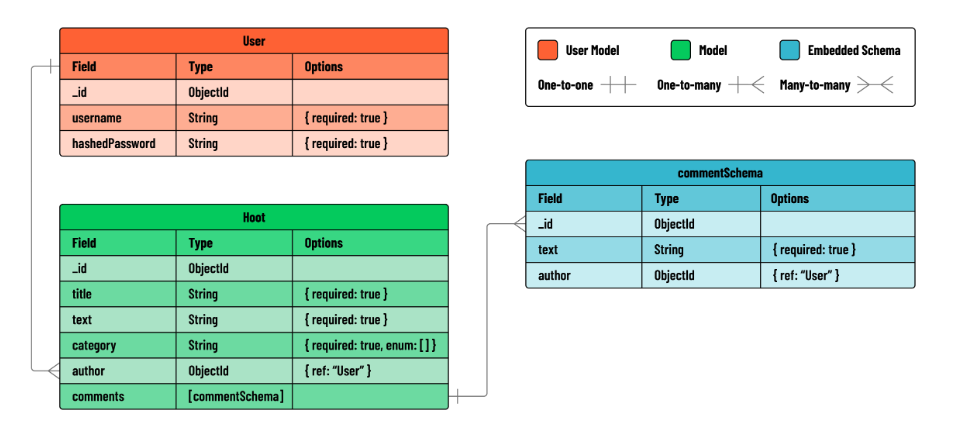

# Hoot Back-End

**Learning objective:** By the end of this lesson, students will understand the architecture and functional requirements of building a secure Express API for a blogging application, including user authentication and CRUD operations for blog posts and comments.

## Overview
- In this module, we’ll build an Express API that serves as the back-end for a full-stack blogging application called Hoot.

- Within our Express API, we’ll implement full CRUD functionality on a blog post resource hoots. Additionally, we will implement **create** functionality on an embedded resource called **comments**.

- Our Express API will make use of the Express API JWT Auth Template. This template provides our Express application with pre configured JWT Authentication. This style of authentication in HTTP uses tokens, or unique identifier strings, to tell who a user is when they’re making an authenticated request.

- Thanks to this template, our Express application will already be able to **sign up** and **sign in** users. The template also includes a **verifyToken** middleware function. The **verifyToken** middleware ensures that any route following it in the middleware pipeline will require authentication before proceeding.

- To demonstrate JWT Authentication, our Express application will use **verifyToken** to protect all routes related to the hoot resource. This means users will be required to sign in before getting access to any **hoot** data.

## User Stories
Our Express API should include functionality for the following user stories:

- As a guest, I should be able to create an account.
- As a user with an account, I should be able to log in to my account.
- As a user, I should be able to create a hoot post.
- As a user, I should be able to read a list of all hoots.
- As a user, I should be able to view information about a single hoot post along with its associated comments.
- As a user, I should be able to add a comment to a specific hoot.
- As the author of a hoot, I should be able to update that hoot.
- As the author of a hoot, I should be able to delete that hoot.
- User stories related to signing up and signing in have been completed for us in the Express API JWT Auth Template, but we will be implementing the remaining features from scratch.

## Entity-Relationship Diagram
Take a look at the ERD below to get a sense of the data we’ll be working with:




**In Summary About This Project**: In this module, students will build a backend for the Hoot blogging platform using Express and MongoDB. They will create a RESTful API that supports full CRUD functionality for blog posts and comments. Throughout the module, students will focus on designing RESTful routes, managing data relationships with MongoDB, and testing API endpoints with tools like Postman. This practical experience will equip students with essential backend development skills and prepare them for building a full-stack MERN application.

<hr>

**Addtl Information About Express JWT Auth Template**

# Express JWT Auth Template

## About

This repo is an Express JWT Auth template meant to be paired with a front-end app utilizing JWT tokens.

## Getting started

Fork and clone this repository to your local machine.

After moving into the cloned directory, run `npm i` to download the dependencies.

Create a `.env` file in the root of the project:

```bash
touch .env
```

and add your MongoDB URI and a secret JWT string to it. Your MongoDB URI will look something like the first entry, but with your username and password:

```plaintext
MONGODB_URI=mongodb+srv://<username>:<password>@sei.azure.mongodb.net/myApp?retryWrites=true
JWT_SECRET=supersecret
```

Start the app in your terminal with:

``` sh
npm run dev
```
